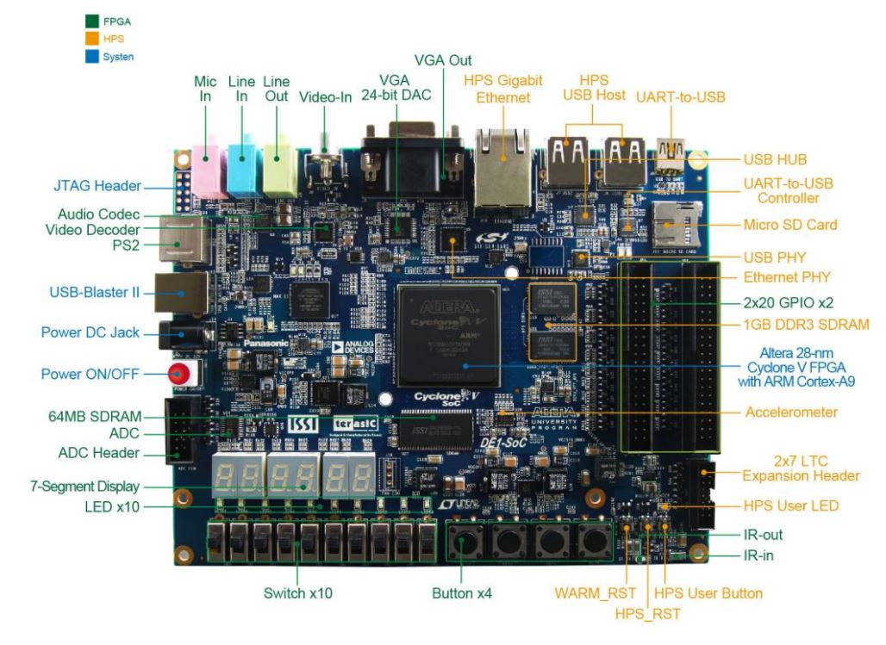

# VHDL Washing Machine Controller

## Overview

This VHDL project implements a controller for a washing machine. The controller manages various aspects of the washing machine's operation, including program selection, temperature control, spin speed, and cycle timing, using a finite state machine model.

## Features

- Program Selection: Users can select from a range of washing programs including SZYBKI, SYNTETYK, ZIMNE, BAWELNA, DELIKATNE, WELNA, SPORT, MIX, and MANUAL using the SW input.
- Temperature Control: Temperature settings are adjustable through the SW2 input, offering a range from 0 to 90 degrees.
- Spin Speed Control: Spin speed can be controlled using the SW3 input, with options ranging from 0 to 1200 RPM.
- LED Indicators: LED outputs provide real-time status indication of the washing machine's state.
- 7-Segment Display Outputs: The controller outputs to various 7-segment displays, showing the program number, remaining time, temperature, and spin speed.
- Safety Feature: Includes a door safety mechanism that prevents the washing cycle from starting if the door is open.

## Altera FPGA DE1-SoC-MTL2
To my project i used Altera chip. The DE1-SoC Development Kit presents a robust hardware design platform built around the Altera
System-on-Chip (SoC) FPGA, which combines the latest dual-core Cortex-A9 embedded cores
with industry-leading programmable logic for ultimate design flexibility. Users can now leverage
the power of tremendous re-configurability paired with a high-performance, low-power processor
system. Altera’s SoC integrates an ARM-based hard processor system (HPS) consisting of processor,
peripherals and memory interfaces tied seamlessly with the FPGA fabric using a high-bandwidth
interconnect backbone. The DE1-SoC development board is equipped with high-speed DDR3
memory, video and audio capabilities, Ethernet networking, and much more that promise many
exciting applications.

Docs: https://dl.btc.pl/kamami_wa/terasic_de1-soc-mtl2.pdf

